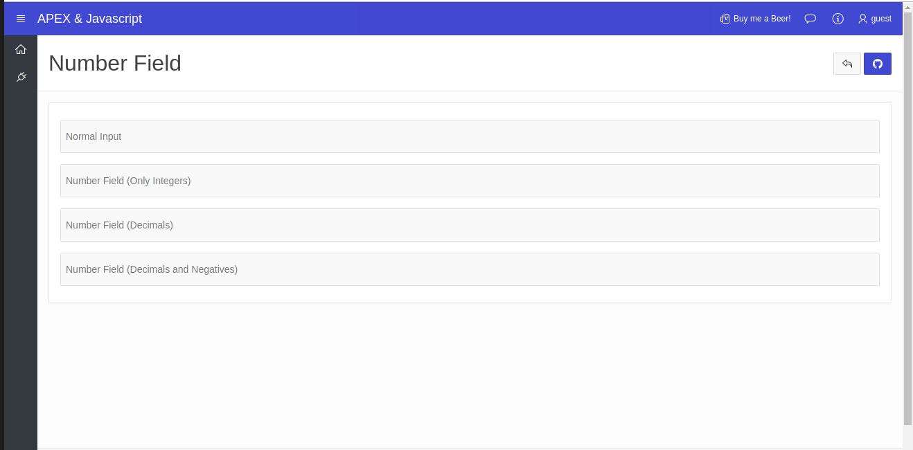

# APEX WebView Region Plugin

Oracle APEX Dynamic Action Plugin for prevent the user from entering unnecessary characters in the fields whose type is number.

# Changelog

- 1.0.0 - Initial release

# Features

- Avoid the use of special characters and letters.
- Allow only digits and decimal separator if specified.
- Allow negatives if specified.

# Install

- Import plugin file **dynamic_action_plugin_com_eportela_numberfield.sql** into the Shared Components > Plugins.

# Usage

Create a dynamic action on your page of type number field, go to attributes and configure it:

- **Allow Decimals:** Specify if the field allows decimals. By default, it doesn't allow enter decimals.
- **Decimal Separator:** Specify the decimal separator. The point (.) is defined by default.
- **Allow Negatives:** Specify if the field allows negatives. By default, it doesn't allow negatives.

# Demo

Demo is avalaible [here](https://apex.oracle.com/pls/apex/f?p=apexjs:numberfield::::::)

# Preview

